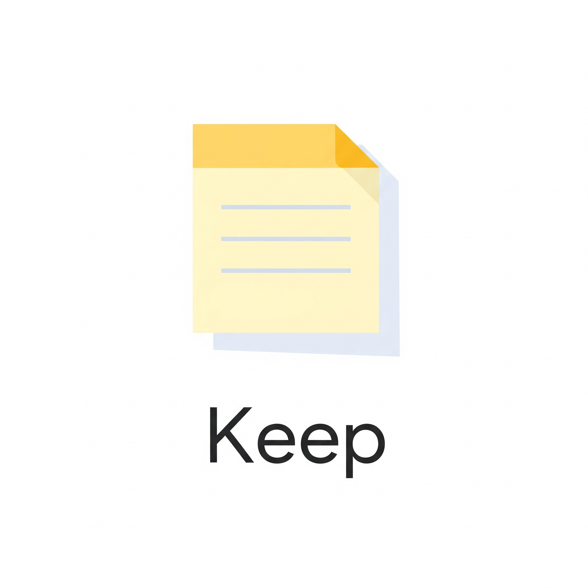

<br />
<div align="center">
  <a href="https://github.com/oshriagronov/keep">
    
  </a>

<h3 align="center">Keep</h3>
  <p align="center">
    Simple Google keep clone which run locally.
  </p>
</div>

## About
The project is a Google keep clone where you can create notes.<br/>
On every note you have the option to write title and content of the note.

### Key features
- Unlimited number of notes.
- Delete notes.
- title is optional.
- content is optional.

## Planned Upgrades
- Edit notes
- Add labels with colors

## Technologies Used
- js, html & css.
- nodejs
- React.

## Media
https://github.com/oshriv65/Keep/assets/72039381/8a89f5cf-67ad-4f6d-bf1d-479ad5a0946c

## Getting Started

To get a local copy up and running follow these simple steps.

### Prerequisites

- Linux, MacOS or Windows
- nodejs
- npm

### Installation

---

1. **Clone and enter the Keep repository:**

   ```bash
   git clone https://github.com/oshriagronov/keep && cd keep
   ```

2. **Install npm modules:**

   ```bash
   sudo npm i
   ```

3. **Run the project:**  

   ```bash
   sudo npm start
   ```

4. **Open the app:**
  Open [http://localhost:3000](http://localhost:3000) to view it in your browser.


## Acknowledgements
I would like to thank to Dr. Angela Yu for creating the great course "The Complete 2023 Web Development Bootcamp".
> Link to the course [here](https://www.udemy.com/course/the-complete-web-development-bootcamp/?kw=The+Complete+2023+Web+Development+Bootcamp&src=sac)
